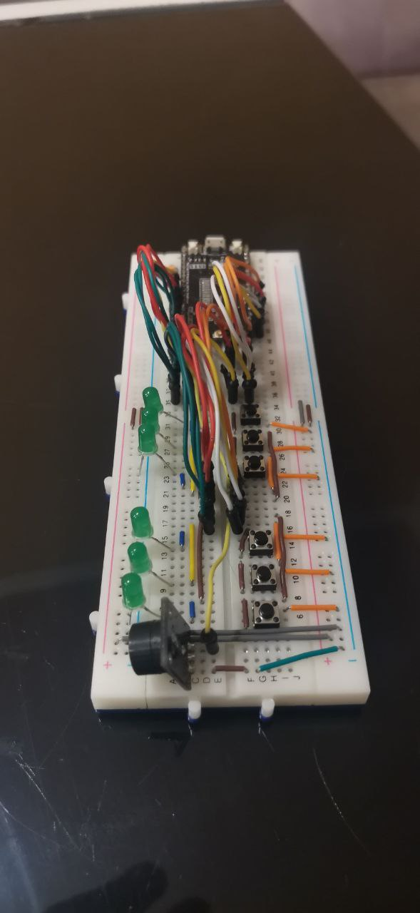
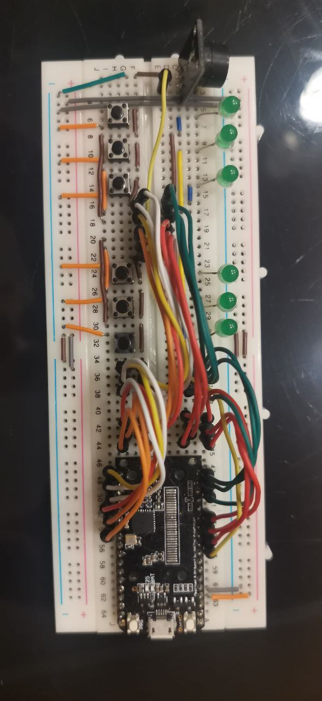
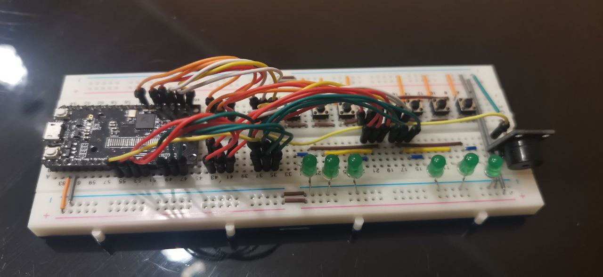
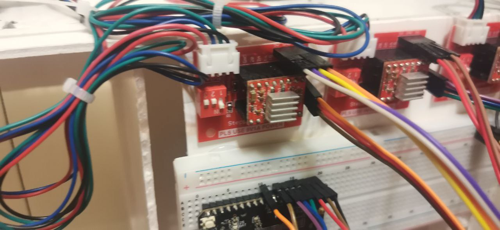
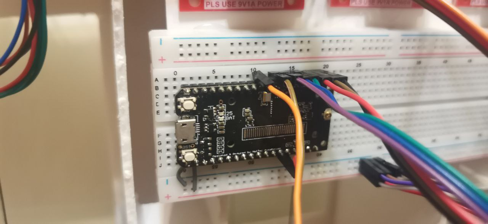
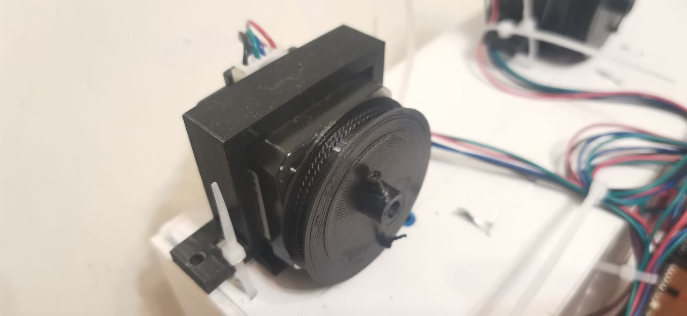
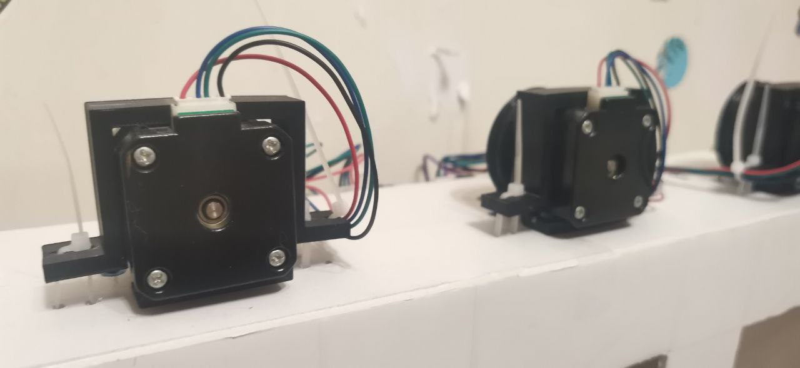
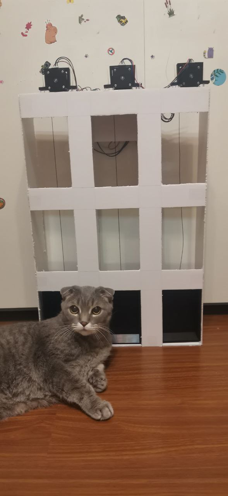

# Система управления лифтами на базе ESP32 с использованием MicroPython

### Введение
Проект представляет собой систему управления тремя лифтами в одноподъездном трехэтажном доме. Система реализована на базе двух плат TTGO LoRa32 v1 ESP32-D0WDQ6, работающих в роли сервера и клиента. Основные цели проекта:
- Оптимизация и ускорение работы лифтов.
- Интуитивное и удобное управление лифтами.
- Реализация надежной и отказоустойчивой системы связи между компонентами.

Система позволяет вызывать лифт на этаж, отправлять лифт на целевой этаж, а также сбрасывать лифты в дефолтное положение (на первый этаж) по команде. Основное взаимодействие между серверной и клиентской платами осуществляется через WebSocket-протокол.

---

### Архитектура системы
#### 1. Аппаратное обеспечение
##### Серверная плата:
- **Плата**: TTGO LoRa32 v1 ESP32-D0WDQ6.
- **Подключаемые компоненты**:
  - Три шаговых двигателя NEMA 17 с драйверами A4988/DRV8825.
  - Светодиод для индикации состояния системы.

##### Клиентская плата:
- **Плата**: TTGO LoRa32 v1 ESP32-D0WDQ6.
- **Подключаемые компоненты**:
  - Три кнопки для вызова лифтов на этажи.
  - Три кнопки на виртуальной панели для отправки лифта на целевой этаж.
  - Шесть светодиодов:
    - Три для индикации вызова лифта на этажи.
    - Три для индикации состояния виртуальной панели.
  - Бипер для звуковой индикации прибытия лифта.

##### GPIO-пины:
- 1 сторона: 21, 13, 12, 14, 27, 26, 25, 33, 32, 35, 34, 39, 36
- 2 сторона: 16, 17, 4, 2, 15, 5, 18, 23, 19, RST, TX, RX, GND, 3.3V, 5V, GND

##### Нельзя использовать:
- GPIO 2: используется для светодиода на корпусе платы.
- GPIO 6-11: Используются для внутренней flash-памяти.
- GPIO 34, 35, 36, 39: Только входные, без подтяжки.
- RST, TX, RX, GND, 3.3V, 5V: Не GPIO.

##### Доступные GPIO:
- 1 сторона: 21, 13, 12, 14, 27, 26, 25, 33, 32.
- 2 сторона: 16, 17, 4, 15, 5, 18, 23, 19.
- GPIO0: кнопка PRG

#### 2. Программное обеспечение
- **Язык программирования**: MicroPython версии 1.24.1.
- **Основные модули системы**:
  - **WiFi**: Управление подключением к сети/точке доступа.
  - **WebSocket**: Обеспечение передачи данных между сервером и клиентом.
  - **Pairing**: Механизм спаривания клиента и сервера через UDP-бродкаст.
  - **LED**: Визуальная индикация состояния системы.
  - **Motor**: Управление шаговыми двигателями для перемещения лифтов.
  - **Elevator**: Логика управления лифтами.
  - **Buttons** и **Buzzer** (на клиентской стороне): Обработка нажатия кнопок и звуковая индикация.

---

### Принципы работы системы
#### 1. Основной алгоритм работы
##### Серверная плата:
1. Поднимает точку доступа (SSID: `ESP32-D0WDQ6-<mac_suffix>`) или подключается к внешней сети.
2. Запускает WebSocket-сервер для обработки команд от клиента.
3. Обрабатывает команды:
   - **"call"**: Вызов лифта на этаж.
   - **"task"**: Отправка лифта на целевой этаж.
   - **"status"**: Запрос текущего состояния задачи.
   - **"reset"**: Сброс лифтов в дефолтное положение.
4. Управляет шаговыми двигателями для выполнения задач.

##### Клиентская плата:
1. Подключается к серверу через точку доступа или внешнюю сеть.
2. Обрабатывает нажатия кнопок вызова и отправки лифта.
3. Отправляет команды на сервер через WebSocket:
   - **"call"**: Вызов лифта.
   - **"task"**: Отправка лифта.
   - **"status"**: Запрос статуса задачи.
4. Управляет светодиодами и бипером для индикации состояния.

#### 2. Алгоритм спаривания
1. **Сервер**:
   - Слушает UDP-бродкаст на порту 5000.
   - Принимает сообщение от клиента с типом `pairing` и отправляет ответ с типом `hello`.
   - Ожидает подтверждение `paired` от клиента.
2. **Клиент**:
   - Отправляет UDP-бродкаст с типом `pairing`.
   - Слушает ответ с типом `hello` от сервера.
   - Отправляет подтверждение `paired`.

#### 3. Работа с лифтами
- Лифты по умолчанию находятся на первом этаже.
- При вызове лифта выбирается ближайший свободный.
- Лифт переходит в активную фазу ожидания (3 секунды) после прибытия на вызываемый этаж.
- Если в течение 3 секунд не была нажата кнопка выбора целевого этажа, лифт возвращается в спящий режим.
- При нажатии кнопки выбора этажа лифт начинает движение к целевому этажу.
- После прибытия на целевой этаж лифт сигнализирует об этом светодиодом и звуковым сигналом.

---

### Основные компоненты системы
#### Серверная часть
- **WiFiAP/WiFiClient**: Управление подключением к сети.
- **WebSocketServer**: Обработка команд от клиента.
- **MotorController**: Управление шаговыми двигателями.
- **ElevatorManager**: Логика управления лифтами, включая выбор оптимального лифта.
- **LEDController**: Визуальная индикация состояния.

#### Клиентская часть
- **WiFiClient**: Подключение к серверу.
- **WebSocketClient**: Передача команд серверу.
- **Buttons**: Обработка нажатий кнопок вызова и выбора этажа.
- **LEDController/ExtendedLEDs**: Индикация состояния вызова и панели.
- **Buzzer**: Звуковая сигнализация.

---

### Пример работы системы
1. Пользователь на первом этаже нажимает кнопку вызова лифта.
2. Клиентская плата отправляет серверу команду `call`.
3. Сервер выбирает ближайший лифт и перемещает его на первый этаж.
4. После прибытия лифта светодиод на первом этаже мигает, а бипер издает сигнал.
5. Пользователь выбирает целевой этаж на панели.
6. Клиентская плата отправляет серверу команду `task`, и лифт начинает движение.
7. После прибытия на целевой этаж лифт сигнализирует об этом светодиодом и бипером.

---

### Краткое описание кода модулей серверной части
1. **main.py**
    - Главный файл системы, точка входа.
    - Инициализирует все основные компоненты (WiFi, моторы, светодиод, WebSocket-сервер, менеджер лифтов).
    - Определяет режим работы (точка доступа или подключение к гостевой сети WiFi).
    - Запускает процесс сопряжения клиента и сервера через UDP-бродкаст.
    - Организует запуск WebSocket-сервера для обработки команд от клиента.
    - Постоянно мониторит состояние подключения и работы системы.

2. **wifi.py**
    - Управление WiFi-подключением в двух режимах: точка доступа (AP) и клиент (STA).
    - **WiFiAP**:
        - Запускает точку доступа с заданным SSID и паролем.
        - Проверяет подключение клиента к точке доступа.
        - Предоставляет IP-адрес точки доступа.
    - **WiFiClient**:
        - Подключается к указанной гостевой сети WiFi.
        - Проверяет состояние подключения.
        - Предоставляет IP-адрес, если успешно подключено.

3. **pairing.py**
    - Управляет процессом сопряжения клиента и сервера.
    - Использует UDP для обмена сообщениями между клиентом и сервером.
    - Отправляет `hello`-ответ клиенту при получении запроса на сопряжение.
    - Ожидает подтверждения сопряжения от клиента.
    - Обеспечивает установление связи и переключение состояния LED-индикации.

4. **websocket.py**
    - Реализация WebSocket-сервера для обработки команд клиента.
    - Выполняет WebSocket-рукопожатие при подключении клиента.
    - Обрабатывает команды от клиента:
        - **call**: Вызов лифта на этаж.
        - **task**: Отправка лифта на конкретный этаж.
        - **status**: Проверка текущего состояния задачи.
        - **reset**: Сброс всех лифтов на первый этаж.
    - Передаёт команды менеджеру лифтов и моторным контроллерам для выполнения.
    - Отправляет клиенту JSON-ответы о состоянии задач.
    - Управляет состоянием подключения и визуальной индикацией LED.

5. **led.py**
    - Управление встроенным светодиодом для индикации состояния системы.
    - Поддерживает различные режимы работы:
        - **not_connected**: Быстрое мигание при отсутствии подключения.
        - **wifi_connect**: Быстрое мигание при подключении к сети.
        - **pairing**: Тройное мигание при процессе сопряжения.
        - **connecting**: Медленное мигание при ожидании подключения.
        - **connected**: Постоянное включение при успешном подключении.
    - Работает асинхронно для обеспечения плавной индикации.

6. **motor.py**
    - Управление шаговыми моторами для перемещения лифтов.
    - Инициализирует моторы с поддержкой включения/выключения, направления и шагов.
    - Реализует плавное разгон/торможение моторов (ускорение/замедление).
    - Поддерживает перемещение мотора на заданное количество шагов или этажей.
    - Отслеживает текущее положение лифта (текущий этаж).
    - Обеспечивает сброс всех моторов на первый этаж.

7. **elevator.py**
    - Логика управления лифтами и распределения задач.
    - Управляет состоянием каждого лифта (этаж, цель, очередь задач).
    - Обрабатывает вызовы лифта и выбирает оптимальный для выполнения задачи:
        - Сначала проверяет лифты, которые уже находятся на нужном этаже.
        - Затем выбирает ближайший свободный лифт.
        - Если все лифты заняты, выбирает лифт с наименьшей очередью задач.
    - Поддерживает отправку лифта на указанный этаж и обработку очереди задач.
    - Реализует механизм сброса всех лифтов на первый этаж.
    - Работает асинхронно для управления несколькими задачами одновременно.

### Краткое описание кода модулей клиентской части
1. **main.py**
    - Главный файл системы, точка входа.
    - Инициализирует все основные компоненты (WiFi, кнопки, LED, WebSocket, зуммер).
    - Обрабатывает выбор режима (сопряжение или подключение к серверу).
    - Запускает асинхронные задачи для управления LED и кнопками.
    - Организует подключение к WiFi, запуск процесса сопряжения с сервером и установку WebSocket-соединения.

2. **wifi.py**
    - Управление WiFi-подключением в клиентском режиме.
    - Предоставляет функции для сканирования доступных сетей и подключения к ним.
    - Обрабатывает переключение между гостевой сетью WiFi и прямым подключением к серверной точке доступа.
    - Реализует логику повторных попыток подключения при сбоях.
    - Предоставляет IP-адрес для использования другими модулями.

3. **pairing.py**
    - Управляет процессом сопряжения клиента и сервера.
    - Использует UDP-бродкаст для обнаружения сервера.
    - Обменивается данными, включая IP-адрес и MAC-адрес, для установления связи.
    - Осуществляет отправку подтверждающего сообщения после успешного сопряжения.
    - Содержит механизм ожидания ответа от сервера.

4. **websocket.py**
    - Реализация WebSocket-клиента для связи с сервером.
    - Обеспечивает отправку RPC-команд (call, task, status, reset) и обработку входящих сообщений от сервера.
    - Реализует обработку "рукопожатия" WebSocket при подключении.
    - Формирует и отправляет WebSocket-кадры для передачи данных.
    - Обрабатывает команды от сервера, включая вызовы лифта, выполнение задач и обновление состояния.
    - Управляет светодиодами и зуммером в зависимости от состояния системы и указаний от сервера.
    - Реализует защиту от конфликтов при обработке задач с использованием блокировок (locks).

5. **led.py**
    - Управление встроенным LED для визуальной индикации.
    - Отображает состояния системы, такие как подключение к WiFi, сопряжение, ошибки и успешное подключение.
    - Поддерживает различные режимы (мигание, постоянное включение, выключение) для отображения статусов.
    - Асинхронно управляет светодиодами вызова и панели лифта.

6. **buttons.py**
    - Обрабатывает ввод от кнопок вызова, кнопок панели и программной (PRG) кнопки.
    - Определяет нажатия кнопок вызова и отправляет команды на сервер через WebSocket (например, вызов лифта или выполнение задачи).
    - Поддерживает проверку активности панели лифта для текущего лифта.
    - Реализует сброс системы через PRG-кнопку.
    - Интегрируется с WebSocket-клиентом для передачи данных о нажатии кнопок.

7. **buzzer.py**
    - Управляет зуммером для воспроизведения звуковых сигналов.
    - Поддерживает воспроизведение тонов, мелодий и предопределённых сигналов (например, прибытие лифта, ошибка).
    - Реализует плавное включение и выключение звуков (ramp-up и ramp-down).
    - Позволяет динамическое управление громкостью звука.
    - Содержит предустановленные сигналы для разных событий (прибытие, ошибка, нажатие кнопки).

---

### Преимущества и особенности
1. **Асинхронность**: Все задачи выполняются неблокирующим образом, что повышает скорость и отзывчивость системы.
2. **Модульность**: Каждый компонент реализован в отдельном модуле, что облегчает разработку и поддержку.
3. **Надежность**: Использование LED и звуковой индикации для отображения состояния системы.
4. **Гибкость**: Возможность работы через точку доступа сервера или внешнюю сеть.

---

### Заключение
Система управления лифтами на базе ESP32 демонстрирует высокую эффективность и гибкость. Она позволяет легко масштабировать проект, добавляя новые функции или увеличивая количество этажей и лифтов. Благодаря асинхронной архитектуре система остается устойчивой к нагрузкам и обеспечивает быстрое выполнение задач.

---

## Клиент. Панель управления лифтами

## Сервер. Корпус, лифты, моторы

